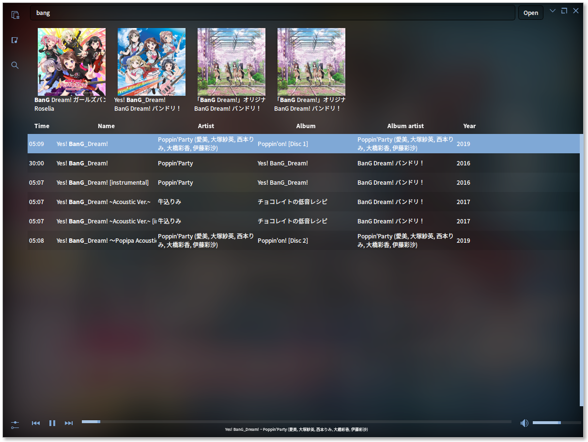

<h1 align="center">aidoru</h1>

<p align="center">a qt music player in python</p>

<p align="center">

</p>

## installation

You must install Qt5 library, taglib headers (`libtag1-dev` in Ubuntu) and python3. After that, do:

```
pip3 install --user -r requirements.txt
```

You can then run `aidoru.py` directly or by invoking python3:

```
python3 ./aidoru.py
```

***Linux users***, if this line:

```
defaultServiceProvider::requestService(): no service found for - "org.qt-project.qt.mediaplayer"
```

appears upon running, then:

 1. install your distro's equivalent to `libqt5multimedia5-plugins`
 2. remove `~/.local/lib/python3*/dist-packages/PyQt5/Qt/plugins/mediaservice/libgstmediaplayer.so`
 3. `ln -s /usr/lib/x86_64-linux-gnu/qt5/plugins/mediaservice/libgstmediaplayer.so ~/.local/lib/python3*/dist-packages/PyQt5/Qt/plugins/mediaservice/libgstmediaplayer.so`

***Windows users***, the latest release is in the [Releases](https://github.com/ffwff/aidoru/releases) tab. You'll also need to install  DirectShow codecs to play audio ([hint: K-Lite Codec Pack](https://www.codecguide.com/download_k-lite_codec_pack_basic.htm))


## usage

Upon first startup, it'll find and index all audio files in your `~/Music` directory (`This PC > Music` for you Windows users).

The player assumes you organize albums into separate folders in your music directory, it'll also automatically locate cover art in those folders.


shortcut     | action
-------------|--------
ctrl+q       | quit
space        | play/pause song
F5           | refresh listing
ctrl+f       | toggle file search bar
ctrl+shift+f | switch to full mode
ctrl+m       | switch to mini mode
ctrl+shift+m | switch to micro mode

## credits

- Breeze/Paper icons
- Design based on [voltra.co](https://voltra.co/)
